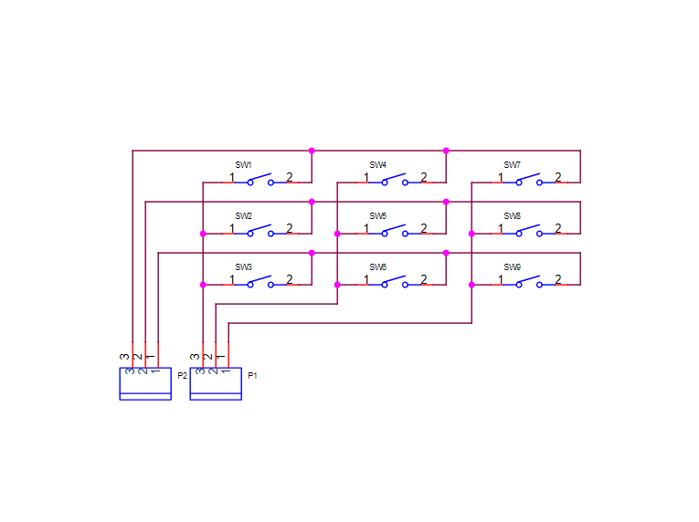
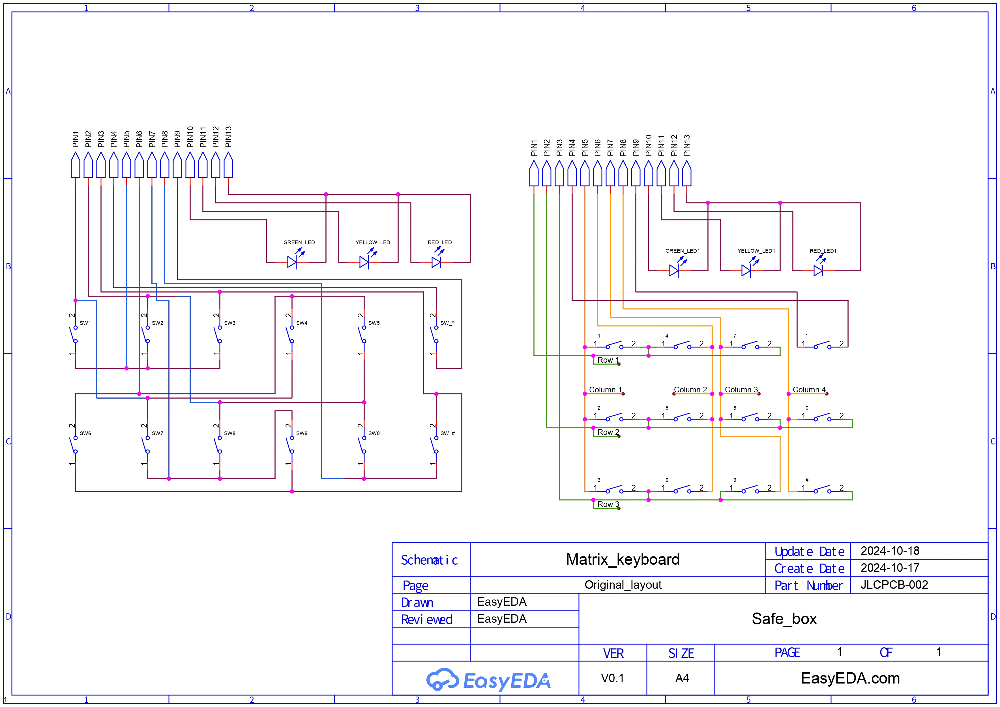

# Introducción :uk:

This proyect was bornt to give a solution to a job need. I was in the need to protect some valuable goods, and a safe box was the best thing to do so. I was in the right place, in the right moment, when some partners removed from a customer, an old safe box, in order to place a new one. This kind of safe box is programed to delay the openning; this means that even if you have the key and the password, the triggering of the electromagnetic bolt which unlocks the lock, won't happen till the programmed delay is over. This is meant to protect the goods on its inside in case the intruder forces the owner of the safe box to open the box. Since box won't open the door till the delay is over, the intruder has to either wait, and maybe get cuaght while waiting; or he has to leave, leaving goods safe. This box was left in a specific place where the things to be recycled are stored. In addition, the password was unknown.

This box is designed to be fixed to a surface, the lock gets locked by the bolt, because of the gravity force. In other words, if the coil where the bolt is placed, is out of power, the bolt stays on its position because of the gravity force, blocking the action of the key over the lock. When the circuit is powerred, and the password provided is right, the circuit powers de bolt's coil, lifting it, and freeing the lock.

  

In the picture above we have the control system. The first thing we can see is the control board, the one implemented by me as replacement of the previous one. We can also see the electromagnetic bolt, the yellowed piece with the "12 Ohms" mark; and finally, the whole lock system. The lock moves left to right according the the key movement. The blue and red arrows show the behavior of the bolt, according to the power supplied to the coild. If the coil, the yellowed rectangle shape piece, is powered, the bolt, the cylinder under / inside the coil, will get attracted to the coil, allowing the free movement of the lock. If the coil is not powered, the bolt falls by gravity attraction, blocking the lock.

The very first thing I had to do was to open the box. Luckily, the key was inside the lock, the main problem was to deal with the bolt. Since it was not fixed to any surface, as soon as I placed the box upside down, the bolt felt inside the coil by gravity force, allowing to open the door. Once the box was opened, I could check each part. 

 

**Original board**: 

 

  

 

This is the original board. There are few interesting elements:

- Microcontroller TSC80C31, with 32 inputs and outputs, y 128 bytes of RAM memory. 
- EPROM memory M27C64A. This memory is ideal for long programs. Here comes an interesting detail of this memory: the window at the top of the memory is used to erase the saved data. It is done by pointing to it with an ultraviolet light. The following pictures show a closer view, through a microscope, of this window.

 

  
  
  
 

 

**Electromagnetic bolt**

 

  

 

We have already talked about this part before. This part is the one locking or freeing the key. The printed vaule is the resistance of the coil, which in this case it is 12 Ohms. This value is the one used to calculate the minimum amount of current needed for the coil to attract the bolt correctly. When the coil is powered through the cables, a magnetic field is created. This magnetic field attracts ferromagnetic elements, in this case, the bolt. When the power is lost, the magnetic field is also lost, freeing the bolt, which falls by the gravity force, blocking the lock.

 

**Keyboard**

 

  

 

The password is provided through the keyboard, the board will be the one evaluating it. If the password entered matches the one burnt on the board, then the bolt will be triggered.
 

 
 

It is easy to see that it is matrix keyboard. This keyboard has 12 conductive membrane push buttons. This kind of push buttons have two parts: the contacts printed int the board, the oval grey parts with a line in the middle; and the layer with the numbers, which is made in rubber with an small conductive surface under each button. When a button is pressed, its conductive part under the rubber layer connects both contacts in the oval part printed in the board, closing the circuit.

 

 

 

In a matrix keyboard, the connections of the buttons are made through columns and rows; each side of each button is connected to a column and a row. In the previous picture we have a matrix keyboard that i did to explain the main concept. The main point is to power one of the sides of push buttons, and to read the voltage value on the other side. We can power the columns, and then we could read the value on each row.

Let's say that we pressed the button 4. We start powering the column number 1, so at this point the columns 2 and 3 are powerless. The column 1, (columns 1), is connected with the side 1 of button 1, with the side 1 of button 2, and with the side one of button 3, (SW1, SW2 y SW3). Therefore, these 3 buttons are set as powered on their side 1. Then, the system starts reading the voltage value on each row. It starts by reading the value of row 1. In the row 1 we have the side 2 of button 1, which was not pressed, which means that the circuit is not closed and the voltage sent through column 1 doesn’t reach the side 2 of the button. This means that the voltage read in the row 1 is 0V. This is understood by the board like the button 1 was not pressed. Then we keep checking the behaviour of the other buttons in the row 1. We meet the button 4, which was pressed. The side 1 of the button 4 is connected to column 2. This column is off at this point of the analysis, therefor, even if the button 4 is pressed in this exact moment, the voltage read in the row 1 is still 0. It happens the same with the button 7. There is no voltage at all in the row 1. It is guaranteed that the button 1 was not pressed, because in order for it to be considered as pressed there must be a positive read in the row 1 while the column 1 is being powered.
Once the main working principle of row 1 and its buttons is understood, we can easily go through the rows 2 and 3. We keep reading the voltage value in the row 2. The column we are working with right now is the number 1, since the button 2 was not pressed it is in the same situation than the button 1, there is not a positive read in the row 2 when the column 1 is powered. It is guaranteed that the button 2 was not pressed. Finally, we read the row 3. Since the button 3 was not pressed, the connection between column 1 and row 3 is not closed, there's no positive read in the row 3 when the column 1 is powered, therefor, the button 3 was not pressed. 

At this point, the read in all the rows is 0, so the system understands that the pressed button is either in column 2 or column 3. The action performed for the column 1 will be performed for the column 2. Columns 1 and 3 are set in a power off state, and the column 2 is powered. The reading process starts again. We start by reading the first row when the column 2 is powered, the result is a positive voltage read. The result is positive because in this example, the button pressed was the number 4, which is connected to the row 1 on its pin number 2, and to the column 2 on its pin number 1. When the button is pressed while the power in the column 2 is on, the circuit gets closed through the row 1, generating a positive read in the row 1. This is understood by the system as "button pressed", in this case, the one associated to row 1 and column 2. Once there is a button pressed, the analysis process is stopped, and the code keeps running.

It is really important to understand how a matrix keyboard works in order to optimize resources. A 9 buttons keyboard would, usually, require at least 9 microcontroller inputs, and all the associated wiring. As we could see in the previous example, for a 9 buttons matrix keyboard we used just 6 connections and way less wiring. Tree of those connections are used as inputs to read the voltage values, and the other 3 contacts are used as outputs to send the high level voltage on each column.

 

 

 

Now that we know what a matrix keyboard is, and how it works, we can see in the previous picture that the keyboard in our safe box is also a matrix keyboard. In the picture we can see two schematics, both of them quite more complex than the first example. Both of them represent the real connections in the keyboard. In the left schematic we see all the push buttons, set in 2 rows, and vertically oriented, close to the 3 LED lights. Some tracks have parts coloured in blue, those blue parts represent the tracks printed in the back face of the board; the wine colour tracks are the front face tracks. The tracks are drawn as they are in the real board, with light changes. The right schematic keeps the real connections between push buttons and pins, but I organized them in a different way, for everyone to easily understand the connections between rows and columns through the push buttons. The yellow tracks represent the columns, the green ones represent the rows. The button * is connected to two independent pins, just because that's how the board developer wanted it to be.

 
 

Teniendo claro todo lo explicado anteriormente, solo queda leerse las comentarios escritos en el propio código para entender el funcionamiento completo del sistema. En un principio, escribí los comentarios en inglés, y tiempo más tarde traduje mis comentarios del inglés al español. En el proceso detecté varios fallos de programación, para los que hice notas en medio de la explicación, para poder revisar dichos fallos en un futuro.

