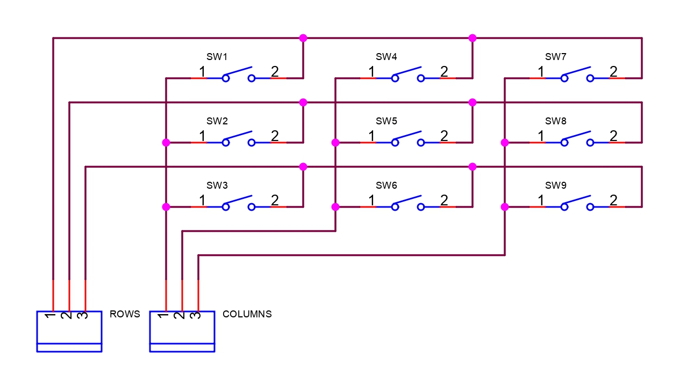
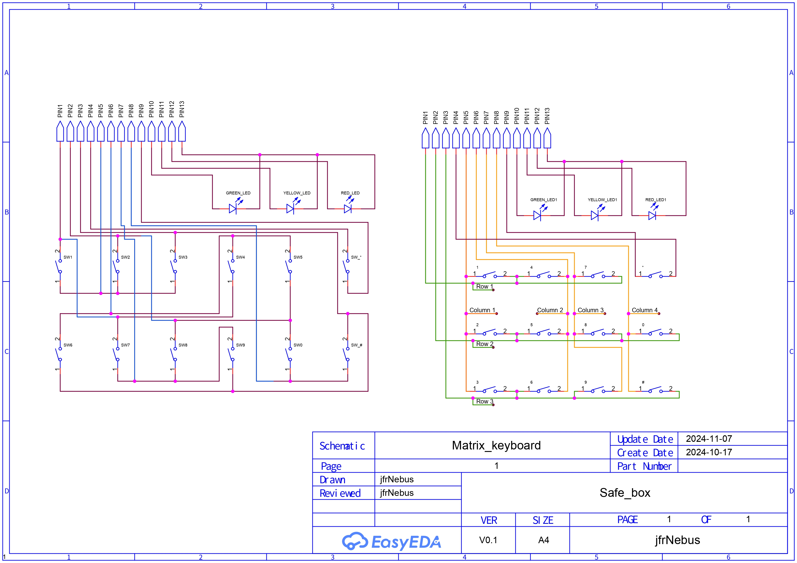

# Introducción :uk:

This proyect was bornt to give a solution to a job need. I was in the need to protect some valuable goods, and a safe box was the best thing to do so. I was in the right place, in the right moment, when some partners removed from a customer, an old safe box, in order to place a new one. This kind of safe box is programed to delay the openning; this means that even if you have the key and the password, the triggering of the electromagnetic bolt which unlocks the lock, won't happen till the programmed delay is over. This is meant to protect the goods on its inside in case the intruder forces the owner of the safe box to open the box. Since box won't open the door till the delay is over, the intruder has to either wait, and maybe get cuaght while waiting; or he has to leave, leaving goods safe. This box was left in a specific place where the things to be recycled are stored. In addition, the password was unknown.

This box is designed to be fixed to a surface, the lock gets locked by the bolt, because of the gravity force. In other words, if the coil where the bolt is placed, is out of power, the bolt stays on its position because of the gravity force, blocking the action of the key over the lock. When the circuit is powerred, and the password provided is right, the circuit powers de bolt's coil, lifting it, and freeing the lock.

  

In the picture above we have the control system. The first thing we can see is the control board, the one implemented by me as replacement of the previous one. We can also see the electromagnetic bolt, the yellowed piece with the "12 Ohms" mark; and finally, the whole lock system. The lock moves left to right according the the key movement. The blue and red arrows show the behavior of the bolt, according to the power supplied to the coild. If the coil, the yellowed rectangle shape piece, is powered, the bolt, the cylinder under / inside the coil, will get attracted to the coil, allowing the free movement of the lock. If the coil is not powered, the bolt falls by gravity attraction, blocking the lock.

The very first thing I had to do was to open the box. Luckily, the key was inside the lock, the main problem was to deal with the bolt. Since it was not fixed to any surface, as soon as I placed the box upside down, the bolt felt inside the coil by gravity force, allowing to open the door. Once the box was opened, I could check each part. 

 

**Original board**: 

 

  

 

This is the original board. There are few interesting elements:

- Microcontroller TSC80C31, with 32 inputs and outputs, y 128 bytes of RAM memory. 
- EPROM memory M27C64A. This memory is ideal for long programs. Here comes an interesting detail of this memory: the window at the top of the memory is used to erase the saved data. It is done by pointing to it with an ultraviolet light. The following pictures show a closer view, through a microscope, of this window.

 

  
  
  
 

 

**Electromagnetic bolt**

 

  

 

We have already talked about this part before. This part is the one locking or freeing the key. The printed vaule is the resistance of the coil, which in this case it is 12 Ohms. This value is the one used to calculate the minimum amount of current needed for the coil to attract the bolt correctly. When the coil is powered through the cables, a magnetic field is created. This magnetic field attracts ferromagnetic elements, in this case, the bolt. When the power is lost, the magnetic field is also lost, freeing the bolt, which falls by the gravity force, blocking the lock.

 

**Keyboard**

 

  

 

The password is provided through the keyboard, the board will be the one evaluating it. If the password entered matches the one burnt on the board, then the bolt will be triggered.
 

 
 

It is easy to see that it is matrix keyboard. This keyboard has 12 conductive membrane push buttons. This kind of push buttons have two parts: the contacts printed int the board, the oval grey parts with a line in the middle; and the layer with the numbers, which is made in rubber with an small conductive surface under each button. When a button is pressed, its conductive part under the rubber layer connects both contacts in the oval part printed in the board, closing the circuit.

 

 

 

In a matrix keyboard, the connections of the buttons are made through columns and rows; each side of each button is connected to a column and a row. In the previous picture we have a matrix keyboard that i did to explain the main concept. The main point is to power one of the sides of push buttons, and to read the voltage value on the other side. We can power the columns, and then we could read the value on each row.

Let's say that we pressed the button 4. We start powering the column number 1, so at this point the columns 2 and 3 are powerless. The column 1, (columns 1), is connected with the side 1 of button 1, with the side 1 of button 2, and with the side one of button 3, (SW1, SW2 y SW3). Therefor, this 3 buttons are set as powered on their side 1. Then, the system starts reading the voltage value on each row. It starts by reading the value of row 1. In the row 1 we have the side 2 of button 1, which was not pressed, which means that the circuit is not closed and the voltage sent through column 1 doesnt reach the side 2 of the button. This means that the voltage read in the row 1 is 0V. This is understood by the board like the button 1 was not pressed. Then we keep understanding the beahaviour of the other buttons in the row 1. We meet the button 4, which was pressed. The side 1 of the button 4 is connected to column 2. This column is off at this point of the analysis,

Sigue por aquí.Sigue por aquí.Sigue por aquí.Sigue por aquí.Sigue por aquí.

 luego aunque se cierre el circuito al presionar el botón, la lectura en la fila 1 sigue siendo 0. Lo mismo ocurre con el botón 7. Esto quiere decir que por la fila 1 no existe voltaje alguno. En este punto se garantiza que no se ha pulsado el botón 1, porque para que dicho botón se considere pulsado, tendría que existir una lectura positiva de voltaje en la fila 1 mientras la columna 1 esta siendo alimentada.

Habiendo entendido el análisis completo del comportamiento de la fila 1 y de cada uno de los botones asociados a ella, podemos resumir el análisis de las filas 2 y 3. Continuamos leyendo el valor de voltaje en la fila 2. La columna que nos interesa es la 1, dado que el botón 2 no ha sido presionado, ocurre lo mismo que con el botón 1, no existe lectura positiva en la fila 2 cuando la columna 1 está siendo alimentada, lo que garantiza que el botón 2 no ha sido presionado. Seguimos leyendo el valor de la fila 3. El botón 3 no se presionó, no se cierra el circuito, no hay lectura de voltaje positiva en la fila 3 cuando la columna 1 está siendo alimentada, por lo que se garantiza que el botón 3 no ha sido presionado.

En este punto, habiendo recibido lectura negativa en las tres filas, el sistema entiende que el botón presionado es alguno de los asociados a las columnas 2 y 3, por lo que se repite la misma actuación. Se retira la alimentación de la columna 1, se alimenta la columna 2, y se mantiene sin alimentación la columna 3. En este punto, se inicia un nuevo proceso de lectura de filas. Empezamos leyendo el valor de la fila uno, que en este caso es un valor positivo. El valor de la fila 1 es positivo porque el botón presionado es el 4, que está asociado a la fila 1 por su lado 2, y a la columna 2 por su lado número 1. Cuando se presiona el botón 4 mientras existe alimentación en la columna 2, se cierra el circuito con la fila 1, generando un valor de lectura positivo en la fila 1. Esto es interpretado por el sistema, el valor de lectura de voltaje positivo, como que dicho botón, el botón asociado a las fila 1 y columna 2, ha sido presionado. En este momento se detiene el análisis y se realiza la operación pertinente. 

Entender el funcionamiento de un teclado matricial es vital para la optimización de recursos, cuando se trabaja con un teclado. Un teclado con 9 botones supondría, habitualmente, si no se usa un teclado matricial, el uso de 9 entradas en un microcontrolador, además de todo el cableado asociado a los mismos. Como hemos visto en el ejemplo anterior, para un teclado de 9 botones, hemos usado 6 contactos del microcontrolador. De esos 6 contactos, 3 se usan como entradas para recibir la lectura de las filas, y 3 como salidas para establecer el pulso alto de voltaje para cada columna.

 

 

 

Teniendo claro qué es, y cómo funciona un teclado matricial, podemos observar, en la imagen anterior, que el teclado de la caja fuerte también es un teclado matricial. En la imagen se observan dos figuras bastante más complejas que la del primer ejemplo. Ambas figuras representan el conexionado real del teclado. En la figura de la izquierda vemos una serie de pulsadores, colocados en dos filas y orientados de forma vertical, junto a los tres diodos LED de colores. Algunas de los tramos de ciertas pistas de conexión son de color azul, representan las partes de las pistas que están impresas por la cara trasera de la placa; las pistas de color vino, representan las pistas impresas en la cara frontal de la placa. El recorrido de algunas de las pistas varía ligeramente respecto a las pistas impresas en la placa, no obstante es una representación clara. La figura de la derecha mantiene el conexionado real entre pulsadores y pines, pero he organizado todo de forma que resulte más fácil percibir la union de las columnas y las filas, con los pulsadores. Las pistas de color amarillo representan las columnas, y las pistas de color verde representan las filas. El boton * se conecta a dos pines de forma independiente, porque así lo creyó oportuno el desarrollador que diseñó la placa del circuito.

 
 

Teniendo claro todo lo explicado anteriormente, solo queda leerse las comentarios escritos en el propio código para entender el funcionamiento completo del sistema. En un principio, escribí los comentarios en inglés, y tiempo más tarde traduje mis comentarios del inglés al español. En el proceso detecté varios fallos de programación, para los que hice notas en medio de la explicación, para poder revisar dichos fallos en un futuro.

